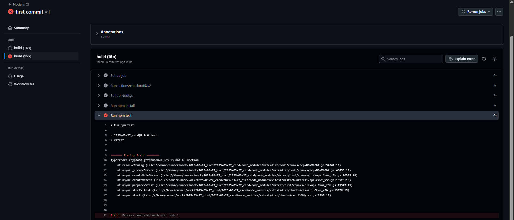

# 新人エンジニアの CI/CD 入門

2025 年 3 月 27 日（木）  
講義時間：約 20 分（デモ含む）

---

## 📌 アジェンダ

1. [CI/CD とは？](#🚀-cicd-とは-13)（3 分）
2. [CI/CD の仕組みと流れ](#⚙️-cicd-の仕組みと流れ)（4 分）
3. [CI/CD のメリット](#🎯-cicd-のメリット)（3 分）
4. [【デモ】GitHub Actions で CI/CD](#🎬-デモ-13)（7 分）
5. [質疑応答](#❓-質疑応答3-分)（3 分）

---

## 🚀 CI/CD とは？ (1/3)

### CI（Continuous Integration）

- 継続的インテグレーション
- コードを頻繁に統合し、自動でビルド・テストを実施すること

### CD（Continuous Delivery / Deployment）

- 継続的デリバリー・デプロイ
- ビルド後のソフトウェアを自動で本番環境に配信・公開すること

---

## 🚀 CI/CD とは？ (2/3)

### 継続的インテグレーション（CI）とは？

**継続的インテグレーション（Continuous Integration, CI）**  
複数の開発者が頻繁に（1 日に数回）コードを統合し、自動でビルド・テストを実施する開発手法。

### CI の基本的な流れ

1. **コードの取得（Checkout）**

   - Git などのリポジトリから最新コードを取得

2. **ビルド（Build）**

   - コンパイルや依存関係の解決を自動で行う

3. **自動テスト（Test）**

   - ユニットテスト・統合テスト・静的解析等を実施

4. **通知（Notify）**
   - 結果を即座に開発者に通知（Slack、メールなど）

---

## 🚀 CI/CD とは？ (3/3)

### CI が重要な理由

- **問題の早期発見**

  - 問題の早期検出で修正コスト削減

- **品質維持・向上**

  - 自動テストにより人的ミスを防止

- **開発効率向上**

  - 手作業の繰り返し作業を自動化、生産性 UP

- **チームコラボレーション促進**
  - 頻繁な統合によりメンバー間の差分やコンフリクトを最小化

---

## ⚙️ CI/CD の仕組みと流れ

<pre class="mermaid">
graph TD
  A[コードのコミット] --> B[自動ビルド]
  B --> C[自動テスト]
  C --> D{テスト成功?}
  D -->|Yes| E[自動デプロイ]
  D -->|No| F[開発者へ通知・修正]
</pre>

---

## 🛠️ 主な CI/CD ツール例

- GitHub Actions（本日のデモ）
- Jenkins（オープンソース CI の定番）
- GitLab CI/CD（GitLab 統合型）
- CircleCI（クラウドネイティブ）
- AWS CodePipeline（AWS 環境向け）

---

## 🎯 CI/CD のメリット

- 開発サイクルの高速化
- フィードバックサイクルの短縮
- 品質向上（人的ミス削減）
- 問題の迅速な検知・対応
- 開発チームの生産性向上
- 開発者が本質的な仕事に集中できる

---

## 🎬 デモ (1/3)

### GitHub Actions による自動デプロイ

1. GitHub にて、リポジトリ作成
1. ローカルにて、諸々準備
1. cicd の設定ファイル
   - .github/workflows/xxx.yml
1. テスト対象のファイ
   - app.js
1. テストファイル
   - tests.app.test.js
1. ローカルから、 GitHub へコミット・プッシュ
1. GitHub の Actions タブで、CICD が作動していることを確認
1. GitHub の Actions タブで、CICD が成功したことを確認

（デモ中、不明点あれば遠慮なく質問を！）

---

## 🎬 デモ (2/3)

### CICD 成功時のログ

### CICD 失敗時のログ

---

## 🎬 デモ (3/3)

### ワークフローの説明

この GitHub Actions のワークフローファイルは、Node.js プロジェクトの継続的インテグレーション（CI）を実行するために使用されます。以下、各セクションについて詳細に説明します。

#### 1. `name: Node.js CI`

この行は、ワークフローの名前を定義します。この名前は GitHub Actions のダッシュボードで表示されます。ここでは「Node.js CI」という名前が付けられています。

#### 2. `on:`

このセクションでは、ワークフローがトリガーされるイベントを指定します。以下の 2 つのイベントが設定されています。

- `push`: `main`ブランチにコードがプッシュされるとワークフローが実行されます。
- `pull_request`: `main`ブランチへのプルリクエストが作成されるとワークフローが実行されます。

つまり、`main`ブランチに変更が加えられたとき（プッシュまたはプルリクエスト）に、この CI パイプラインが実行されます。

#### 3. `jobs:`

このセクションでは、CI パイプラインで実行するジョブを定義します。ここでは 1 つのジョブ「build」があります。

##### `build`ジョブ

- **`runs-on: ubuntu-latest`**: ジョブは`ubuntu-latest`という最新の Ubuntu 環境で実行されます。GitHub Actions は複数の OS（Linux、macOS、Windows）をサポートしており、この場合は Linux 環境で実行されます。

- **`strategy: matrix`**: マトリックス戦略を使用して、複数の Node.js バージョンでテストを並列実行します。以下の設定により、`node-version`として`14.x`と`16.x`の 2 つのバージョンが指定されています。

  - `node-version: [14.x, 16.x]`: これにより、Node.js のバージョン 14.x と 16.x でテストが並行して実行されます。これを使うことで、複数のバージョンでの互換性を確認できます。

##### `steps:`

このセクションでは、ジョブ内で実行する具体的なステップ（アクション）を順番に定義します。

1. **`- uses: actions/checkout@v2`**  
   このステップは、リポジトリのコードをチェックアウト（取得）するために使用されます。これにより、GitHub Actions ランナーはリポジトリのコードを取得し、後続の処理を実行できるようになります。

2. **`- name: Set up Node.js`**  
   このステップでは、`actions/setup-node`という GitHub Actions の公式アクションを使用して、指定された Node.js バージョンをセットアップします。`${{ matrix.node-version }}`は、マトリックスの設定に基づいて Node.js のバージョン 14.x または 16.x を指定します。

3. **`- run: npm install`**  
   このステップでは、Node.js プロジェクトの依存関係をインストールするために`npm install`を実行します。これにより、`package.json`に記載された依存パッケージがインストールされます。

4. **`- run: npm test`**  
   このステップでは、テストスクリプトを実行するために`npm test`を実行します。通常、`npm test`は`jest`や`mocha`などのテストフレームワークを実行し、テストを実行します。

#### 4. ワークフローの流れ

1. `main`ブランチにコードがプッシュされるか、`main`ブランチへのプルリクエストが作成されると、このワークフローがトリガーされます。
2. `ubuntu-latest`環境で、指定された Node.js バージョン（14.x と 16.x）でテストが実行されます。
3. 各バージョンで、リポジトリのコードがチェックアウトされ、依存関係がインストールされ、テストが実行されます。

このワークフローにより、異なる Node.js バージョンでの互換性をチェックし、プロジェクトが正常に動作するかを確認できます。

---

## ❓ 質疑応答（3 分）

---

## 📚 補足資料（参考用）

### 発表資料

- [これまでの勉強会の資料](https://github.com/shota1998/presentation/tree/main)
- [デモ](https://github.com/shota1998/2025-03-27_cicd/actions)

### 参考文献

- Martin Fowler『Continuous Integration』

  - [martinfowler.com/articles/continuousIntegration.html](https://martinfowler.com/articles/continuousIntegration.html)

- Atlassian『CI（継続的インテグレーション）とは？』

  - [atlassian.com/ja/continuous-delivery/continuous-integration](https://www.atlassian.com/ja/continuous-delivery/continuous-integration)

- GitLab ドキュメント『CI/CD』

  - [docs.gitlab.com/ee/ci/](https://docs.gitlab.com/ee/ci/)

- GitHub Actions 公式ドキュメント
  - [docs.github.com/ja/actions](https://docs.github.com/ja/actions)

---

# ご清聴ありがとうございました 🎉
